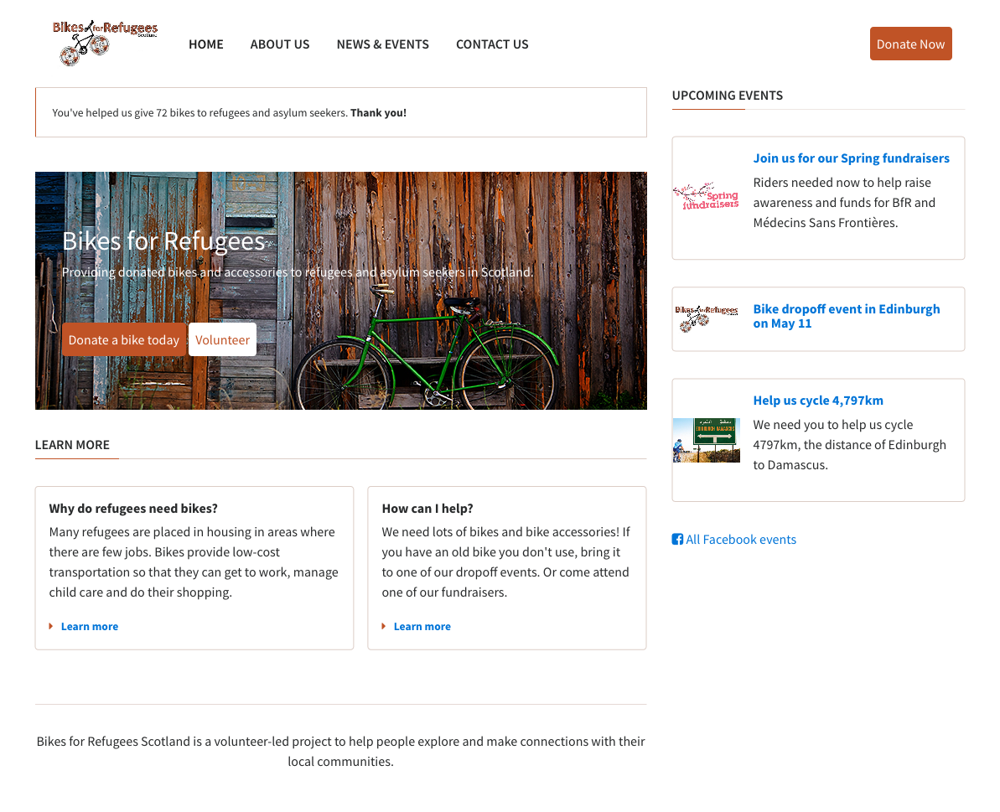

# bikes-for-refugees
Exercise for HTML & CSS - lesson 1

### Set up

**Clone** this repository onto your machine. Remember [the git cheat-sheet]( https://syllabus.codeyourfuture.io/git/desktop/cheatsheet#i-want-to-get-code-from-a-repo-onto-my-computer-cloning) if you get stuck!

Open up the repository you just cloned (again, check the [git cheat-sheet](https://syllabus.codeyourfuture.io/git/desktop/cheatsheet#i-want-to-open-visual-studio-code-with-code-from-my-repository) if you need help!)

You're now ready to code!

### Exercise

The aim of the exercise is for your webpage to look like the following screenshot.

Open the `index.html` file in your browser, and compare it to the image of the final result. What's different?

#### Use semantic markup

Where necessary, replace the `
`s with semantic HTML tags. This will not render differently in the browser, but it's good practice to use semantic markup when you can!

#### Fix the broken images

Some of the links to images are broken. The images you need are in the `images` folder - please replace any broken image links with the correct paths.

#### Style buttons

There are 3 buttons on the page. They need to be styled correctly - remember, re-use styles as much as possible by using classes.

#### Fix the positioning

Use Flexbox to move elements around so they are positioned correctly.

### Submit your work

Once you've finished, **open a pull request** so your work can be reviewed by a mentor.

As always, you can check [the git cheatsheet](https://syllabus.codeyourfuture.io/git/desktop/cheatsheet#i-want-to-send-my-code-to-volunteers-pushing) if you get stuck!
